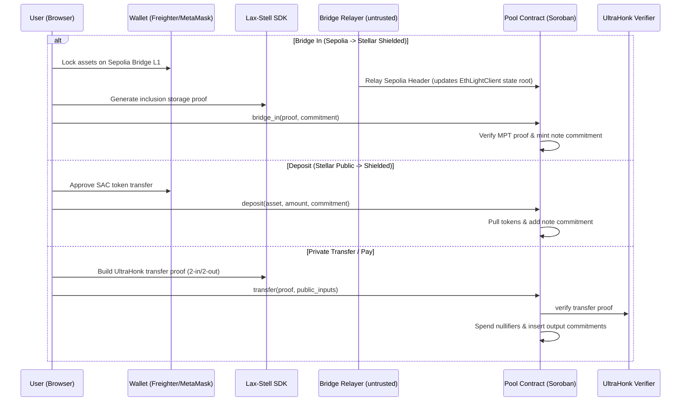
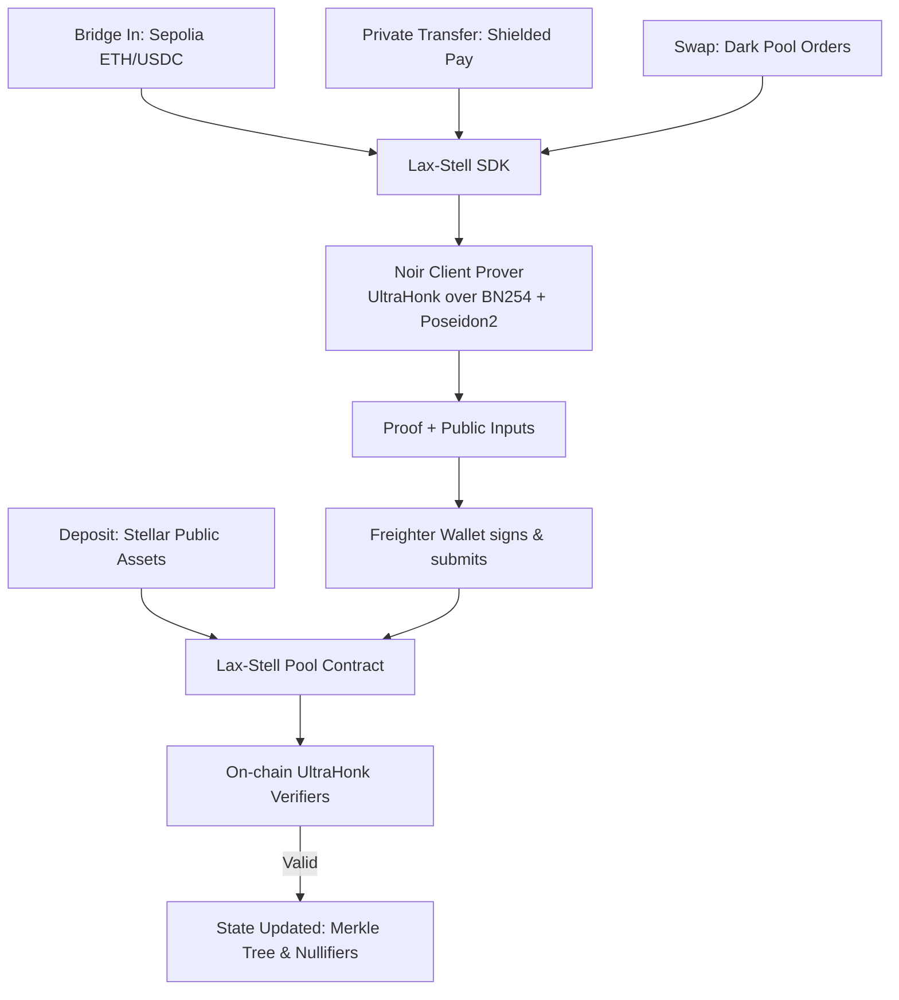

<p align="center">
  
</p>

<h1 align="center">Lax-Stell</h1>

<p align="center">
  A full-privacy platform on Stellar — bridge assets into a shielded layer, hold private multi-asset balances, send confidential payments, and trade on a zero-knowledge dark pool — all verified on-chain by Soroban smart contracts.
</p>

<p align="center">
  
  
  
  
  
</p>

<p align="center">
  <a href="#overview">Overview</a> ·
  <a href="#why-lax-stell">Why Lax-Stell</a> ·
  <a href="#the-system-flows">System Flows</a> ·
  <a href="#smart-contracts">Contracts</a> ·
  <a href="#how-it-works">How It Works</a> ·
  <a href="#architecture">Architecture</a> ·
  <a href="#cross-chain-bridge">Cross-Chain Bridge</a> ·
  <a href="#quick-start">Quick Start</a>
</p>


---

## Overview

Lax-Stell is a full-privacy platform on Stellar. A user deposits classic Stellar assets (like XLM or USDC via the Stellar Asset Contract) or bridges assets from Ethereum Sepolia into a shielded pool. Once inside, balances hide behind Poseidon2 note commitments in a Merkle tree. Users can privately transfer value, trade on a zero-knowledge dark pool, or withdraw back to a public address — all without revealing amounts, assets, or participant links on-chain.

Every state transition out of the shielded layer is gated by a **zero-knowledge UltraHonk proof generated client-side** (compiled from Noir circuits) and verified on-chain by Soroban smart contracts.

> **One pool. Four flows. One rule: your balances, transactions, and orders stay completely private.**
>
> - **Bridge In** moves assets from Ethereum Sepolia into Stellar shielded notes via Ethereum sync-committee BLS verification.
> - **Shield (Deposit)** moves a public Stellar asset into the pool, turning it into a shielded note commitment.
> - **Private Pay (Transfer)** pays another user inside the pool with hidden amounts and sender → receiver links.
> - **Swap (Dark Pool)** matches buy and sell orders at the midpoint of the order book without revealing prices or trade sizes.
> - **Private Withdraw** cashes out shielded notes back to any public Stellar address, verified by the on-chain verifier.

---

## Table of Contents

- [Overview](#overview)
- [Why Lax-Stell](#why-lax-stell)
- [The System Flows](#the-system-flows)
- [Smart Contracts](#smart-contracts)
- [How It Works](#how-it-works)
- [Architecture](#architecture)
- [Tech Stack](#tech-stack)
- [Key Files](#key-files)
- [Cross-Chain Bridge](#cross-chain-bridge)
- [Quick Start](#quick-start)
- [Hackathon](#hackathon)
- [License](#license)

---

## Why Lax-Stell

Stellar is fast, cost-effective, and fully transparent by design. Every payment, asset swap, and account balance is public and permanently indexed. For real-world use cases — payroll, B2B vendor payments, private treasury, and high-volume trading — that absolute transparency is a liability. 

The existing options fall short:
- **Fresh wallets per transaction** — tedious, and funding trails link them on the public graph.
- **Mixers or centralized custodians** — compromise self-custody and introduce third-party risk or potential seizure.
- **Off-chain scaling or sidechains** — mean leaving Stellar's assets, speed, and liquidity behind.

**How can we enable privacy-preserving transactions and trades directly on Stellar without sacrificing self-custody?**

Lax-Stell answers this with six core primitives on the Soroban stack:
1. **Client-side UltraHonk Proving (Noir)** — Proofs are generated client-side using Noir circuits compiled to WASM/JS. Secret inputs (note keys, amounts, blinding factors) never leave the device; the hash is Poseidon2 over BN254, running off-thread.
2. **Shielded Note Pool** — Deposits create note commitments in an on-chain Merkle tree. Spending a note reveals only a nullifier (to prevent double-spend) and new commitments — keeping amounts and owners private.
3. **Four system flows, one pool** — Shield, Pay (Transfer), Swap (Dark Pool), and Withdraw all operate against the same pool.
4. **On-chain Verification** — Gated by UltraHonk verifier contracts over BN254. The proofs bind public inputs and parameters, preventing tampering.
5. **Ethereum sync-committee BLS verification** — Native Soroban BLS12-381 signature checking updates Ethereum headers without SNARK-wrapping.
6. **Merkle-Patricia Storage Proofs** — Direct verification of Ethereum state on Soroban enables true trust-minimized bridging.

<details>
<summary><b>Meet Sarah</b> — the person this is for</summary>

<br>

Sarah runs a remote software studio and pays contractors in USDC on Stellar. Stellar's speed and fees are ideal, but her entire financial history, running balance, and payroll structures are publicly exposed to competitors and bad actors. She doesn't want to move to another chain — she wants to keep using Stellar's assets and liquidity, but keep the amounts and counterparties private. With Lax-Stell, Sarah can shield her USDC, pay her contractors' shielded keys privately, and let them withdraw to their public accounts, keeping the whole process confidential without surrendering custody of her funds.

</details>

---

## The System Flows

Lax-Stell coordinates multiple flows against the shielded pool, changing only the verification circuit and public inputs.

| Flow | **Bridge In** | **Shield (Deposit)** | **Private Pay (Transfer)** | **Swap (Dark Pool)** | **Private Withdraw** |
|---|---|---|---|---|---|
| **Direction** | Ethereum → Stellar Shielded | Stellar Public → Shielded | Shielded → Shielded | Shielded → Shielded | Shielded → Stellar Public |
| **Circuit** | Merkle-Patricia Storage Proof | none (Public-to-Shielded Deposit) | `transfer` circuit | `place_order`, `match_orders` | `withdraw` circuit |
| **Inputs/Outputs** | Ethereum lock storage path | Public asset tokens | 2 input notes → 2 output notes | Order commitment & notes | Input note → public recipient |
| **Recipient** | Stellar Shielded Key | Stellar Shielded Key | Shielded Key | Shielded Key (DEX pool) | Public Stellar Address (`G...`) |
| **Effect** | Shielded note created | Shielded note created | Inputs nullified, outputs created | Funds locked, traded, and settled | Input nullified, public tokens out |
| **Result** | Sepolia ETH/USDC → Stellar note | Balance shielded | Balance transferred | Midpoint matching, atomic swap | Balance public again |
| **What stays hidden** | Origin link & details | In-pool balance | Amount, asset, sender → receiver link | Side, size, price, trade match | Amount, asset, withdraw source |

---

## Smart Contracts

### Addresses (Stellar Testnet)

The full system is live and verified on Stellar Testnet.

| Contract | Address | Description |
|---|---|---|
| **Lax-Stell Pool** | [`CBZNNVUKTG6YSVT3NGV7MDVL5ZQO5D4KLLIRFAGBCORPH7Q62ZHS5RP3`](https://stellar.expert/explorer/testnet/contract/CBZNNVUKTG6YSVT3NGV7MDVL5ZQO5D4KLLIRFAGBCORPH7Q62ZHS5RP3) | Core pool handling deposits, transfers, swaps, and withdrawals. |
| **Verifier · withdraw** | [`CDS245ZQLXFIYD2TPSJWZLAO6TOZOGRF6FQWAJ35J5SG6A7WNMHUMD5B`](https://stellar.expert/explorer/testnet/contract/CDS245ZQLXFIYD2TPSJWZLAO6TOZOGRF6FQWAJ35J5SG6A7WNMHUMD5B) | On-chain UltraHonk verifier checking withdraw proofs. |
| **Verifier · transfer** | [`CCTHUAA3I4R2BRUQEFREHQ3AWVLTCZECAZ7JRG5S23FM44LP27RY5NZB`](https://stellar.expert/explorer/testnet/contract/CCTHUAA3I4R2BRUQEFREHQ3AWVLTCZECAZ7JRG5S23FM44LP27RY5NZB) | On-chain UltraHonk verifier checking transfer proofs. |
| **Verifier · place_order** | [`CABWY7YM7C4FCJBGQ7KG47N6NKZOBHWGMHAEYDTOGE6LDPOLZNGR2BF6`](https://stellar.expert/explorer/testnet/contract/CABWY7YM7C4FCJBGQ7KG47N6NKZOBHWGMHAEYDTOGE6LDPOLZNGR2BF6) | On-chain UltraHonk verifier checking order placement. |
| **Verifier · match_orders** | [`CCKOCCPIYRRSCFNGDW3BDOGW4R2V7XY6KYHZVJDFB5KTKR5U3LPMAB5T`](https://stellar.expert/explorer/testnet/contract/CCKOCCPIYRRSCFNGDW3BDOGW4R2V7XY6KYHZVJDFB5KTKR5U3LPMAB5T) | On-chain UltraHonk verifier checking midpoint matches. |
| **Verifier · cancel_order** | [`CCU4JPTB4KRSG2N6YOTPT7SDXMYIC7RJOMEHUCR44FADEBRBWXQTTB2M`](https://stellar.expert/explorer/testnet/contract/CCU4JPTB4KRSG2N6YOTPT7SDXMYIC7RJOMEHUCR44FADEBRBWXQTTB2M) | On-chain UltraHonk verifier checking order cancellations. |

### Live ZK Proof Verification (E2E)

Verified end-to-end on the current pool with a **real Noir/UltraHonk proof** (14,592-byte proof / 1,760-byte VK, keccak transcript) checked inside the Soroban contract:
- **Deposit** 1 XLM → shielded note at leaf 0, commitment `0f090472…78e2…f92d0a` ([tx `cdaa631c…`](https://stellar.expert/explorer/testnet/tx/cdaa631c68bedd73a7cf469285e21c4d8ece913100baf9ae6f626db542dca614), SUCCESS).
- **Withdraw** with a real ZK proof → verified on-chain by the `withdraw` verifier, nullifier `02e885ea…5f85884`, 1 XLM released to the recipient ([tx `d2d2aca3…`](https://stellar.expert/explorer/testnet/tx/d2d2aca363087a082483b905d5e7ae11ede07d934ed9ccfd46ffcfe9c44ad313), SUCCESS).

---

## How It Works

**User Flow** — `Connect → Bridge / Shield → Receive / Pay Privately → Trade / Swap → Withdraw`
1. **Connect** Freighter wallet and MetaMask (for Ethereum L1 bridge).
2. **Shield** public assets (XLM/USDC) into the pool, or **Bridge** assets from Ethereum Sepolia.
3. **Pay** a friend's shielded address privately (2-in/2-out transfer).
4. **Trade** assets on the Dark Pool (Swap) by placing midpoint orders.
5. **Withdraw** to a public Stellar address whenever needed.

**Proof Flow (Browser/Client)** — `Derive keys → Build circuit inputs → Prove (Noir) → Prepare Soroban tx`
1. **Derive keys** from a wallet signature (cached locally).
2. **Build inputs** from unspent notes, target amounts, and recipient details.
3. **Prove** UltraHonk over BN254 with Poseidon2 using client-side Noir/bb.
4. **Prepare** and submit the Soroban transaction containing the proof and public inputs.

**On-chain Flow**
```
User / Submitter            Pool Contract (Soroban)                 Verifier
       |                             |                                  |
     Transact ---------------------->|                                  |
       |                             |-- verify UltraHonk proof ------->|
       |                             |-- spend nullifiers & add leaf    |
       |                             |<-- verification result (Ok) -----|
       |<-- confirmed tx ------------|
```

---

## Architecture

### System Flow



### Proof Pipeline



---

## Tech Stack

| Layer | Technology |
|---|---|
| **Frontend** | React 18, Vite, Tailwind CSS v3, Three.js, React Three Fiber (R3F) |
| **Wallet** | Freighter (via `@creit.tech/stellar-wallets-kit`), MetaMask (via `wagmi`/`viem`) |
| **Blockchain** | Stellar Testnet (Soroban), Ethereum Sepolia (L1 Bridge) |
| **Stellar SDK** | `@stellar/stellar-sdk` |
| **Zero-Knowledge** | Noir (`1.0.0-beta.9`), Barretenberg (`0.87.0`), UltraHonk over BN254, Poseidon2 |
| **Ethereum Client** | `EthLightClient` (BLS12-381 verification on Soroban), Merkle-Patricia Trie (MPT) verification |
| **Off-chain Matcher** | TypeScript order matching engine |
| **Base PoC** | Built natively from scratch for Stellar Hacks: Real-World ZK |

---

## Key Files

The core implementation is organized into the following modules:

| Component | Directory / File | Description |
|---|---|---|
| **Noir Circuits** | [`circuits/noir/`](./circuits/noir/) | Contains Noir code for `withdraw`, `transfer`, `place_order`, `match_orders`, and `cancel_order`. |
| **Smart Contracts** | [`contracts/`](./contracts/) | Soroban smart contracts including the main pool (`lax-stell-pool`) and UltraHonk verifiers. |
| **Lax-Stell SDK** | [`sdk/`](./sdk/) | TypeScript library to compute commitments, nullifiers, Merkle trees, generate Noir proofs, and build transactions. |
| **Ethereum Bridge L1** | [`bridge/l1/`](./bridge/l1/) | Solidity bridge contract (`LaxStellBridgeL1`) to lock/unlock funds on Sepolia. |
| **Light Client Relayer** | [`bridge/relayer/`](./bridge/relayer/) | Untrusted TypeScript relayer feeding Ethereum finality headers and BLS signatures to Soroban. |
| **Order Matcher** | [`matcher/`](./matcher/) | Off-chain match engine to pair sealed orders and execute midpoint swaps on-chain. |
| **Web Frontend** | [`frontend/`](./frontend/) | React/Vite dashboard to bridge, pay, trade, and track portfolio. |
| **Specifications** | [`SPEC.md`](./SPEC.md), [`SHARED.md`](./SHARED.md), [`TOOLCHAIN.md`](./TOOLCHAIN.md) | Design specs, cross-component cryptographic constants, and toolchain configurations. |

---

## Cross-Chain Bridge

The cross-chain bridge is a trust-minimized pipeline moving assets from Ethereum Sepolia to Stellar Testnet:
1. **Lock**: Users lock ETH/USDC in the L1 Solidity bridge contract on Sepolia (`0xcF40c553…`).
2. **Light Client Sync**: An Ethereum sync-committee BLS signature is verified natively on Soroban (`EthLightClient`), updating Ethereum headers.
3. **Minting Shielded Notes**: `bridge_in` verifies the inclusion of the L1 lock via Merkle-Patricia storage proof, generating a shielded note natively on Stellar.

No trusted relayer or custodian holds authority. Full instructions and proofs are detailed in [BRIDGE_DEPLOYMENT.md](./BRIDGE_DEPLOYMENT.md).

---

## Quick Start

### Prerequisites

- Node.js 20+ and `pnpm`
- [Freighter Wallet](https://www.freighter.app/) configured for Stellar Testnet
- Rust toolchain and target `wasm32-unknown-unknown`
- Pinned cryptographic tools (refer to [TOOLCHAIN.md](./TOOLCHAIN.md) for pinned versions):
  - `nargo` `1.0.0-beta.9`
  - `bb` `0.87.0`
  - `stellar-cli` `27.0.0`

### 1. Environment Setup

Source the environment script to place the pinned toolchain binaries onto your `PATH`:
```bash
source ./env.sh
```

### 2. Run Circuit Tests

Validate the Noir circuits locally:
```bash
cd circuits/noir/withdraw && nargo test
```

### 3. Build Smart Contracts

Compile the Soroban smart contracts to WebAssembly:
```bash
cd contracts && cargo build --target wasm32-unknown-unknown --release
```

### 4. Build SDK and Start Frontend

Install workspace dependencies, build the packages, and launch the Vite development server:
```bash
# In the repository root
pnpm install
pnpm build
pnpm --filter frontend dev
```
Open `http://localhost:5173` to interact with the Lax-Stell application.

### 5. Running End-to-End Tests

Verify the complete deposit and ZK-withdraw loop against the live testnet contracts:
```bash
./scripts/e2e.sh
```

---

## Hackathon

| | |
|---|---|
| **Event** | Stellar Hacks:(APAC Stellar ) |
| **Track** | Payment & Consumer Applications / DeFi & Ecosystem Composability |
| **Network** | Stellar Testnet |

---

## License

Lax-Stell application code is released under the **MIT License**.

---

<p align="center"><i>Your balances, transactions, and orders stay completely private. Lax-Stell.</i></p>
